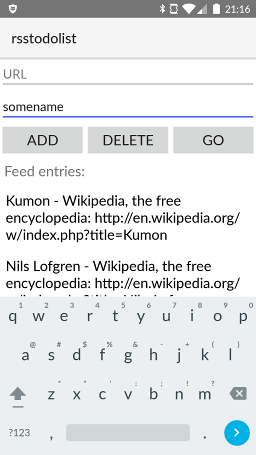

# rsstodolist-native

Native mobile app for [rsstodolist](https://rsstodolist.appspot.com/), built using [nativescript](https://docs.nativescript.org).

## Screenshot

Currently tested only on Android (One Plus One).

# Build / deploy on Android

## Requirements

  * [nativescript](http://docs.nativescript.org/getting-started#install-nativescript-and-configure-your-environment)
  * Android SDK with API version 22 ! ([see that stackoverflow question](https://stackoverflow.com/questions/32723748/cannot-find-a-compatible-android-sdk-for-compilation-when-running-tns-platform))

## Copy configuration

copy `app/config.json.dist` to `app/config.json` (and change or add servers if needed)

## to run on a device

`tns run android`

## to deploy on a device

`tns deploy android`

# Attribution

Icons comes from [Piotr Adam Kwiatkowski](http://ikons.piotrkwiatkowski.co.uk/). Thanks
